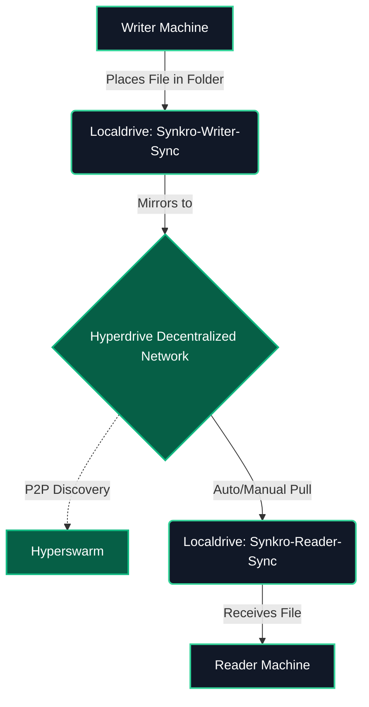
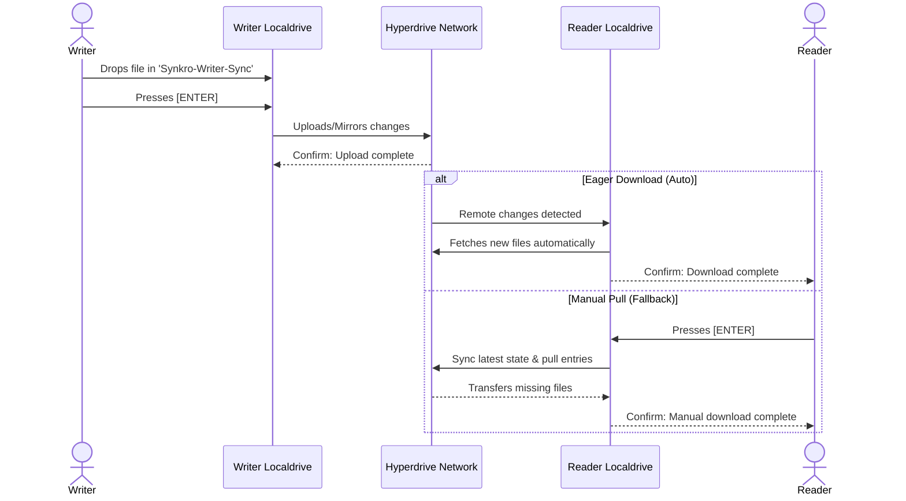

# 🔄 Synkro - Decentralized P2P File Synchronization


> **Serverless, lightning-fast file synchronization across devices using the Pear/Bare ecosystem.**

Synkro eliminates the need for centralized cloud storage (like Google Drive or Dropbox) by enabling direct, peer-to-peer (P2P) file synchronization. It securely mirrors files between a "Writer" (source) and one or multiple "Readers" (destinations) without any intermediary servers.

---

## 🔗 Quick Links
* 🚀 **Run the App (Pear Link):** `pear://fhe31rfz6wktgozcryhon7jnfnpda5jsmopecka6utabtokpxb6o`
* 🎥 **Pitch/Demo Video:** https://youtu.be/4fjl3_hGBb8

---

## 🚀 The Problem vs. The Solution

* **The Problem:** Traditional file synchronization relies on centralized cloud providers, raising privacy concerns, requiring subscriptions, and creating single points of failure.
* **The Solution:** Synkro leverages **Hyperdrive** and **Localdrive** within the Pear ecosystem to create a serverless, end-to-end encrypted P2P synchronization tool. Files are transferred directly between peers in real-time.

---

## ⚙️ Core Features
* 🔗 **Peer-to-Peer Sync:** Direct file transfer without centralized servers.
* ⚡ **Eager Downloading:** Readers automatically detect and pull new files from the decentralized network.
* 🛡️ **Manual Fallback:** A robust "Enter to Pull" feature ensures files can always be synced manually if auto-sync faces network delays.
* 📁 **Auto-Directory Management:** Automatically generates required sync folders (`Synkro-Writer-Sync` & `Synkro-Reader-Sync`) for a seamless user experience.

---

## 📊 System Visualizations

### 1. System Architecture

### 2. Synchronization Flow (Writer to Reader)

## 🏗️ Architecture & Tech Stack
* **Ecosystem:** Pear / Bare (Serverless Runtime)
* **P2P Networking:** Hyperswarm
* **File System:** Hyperdrive (Decentralized) & Localdrive (Local FS interaction)
* **Core Logic:** JavaScript (ES Modules)

## 🛠️ Prerequisites (For Judges & Users)

Ensure you have the Pear CLI installed (v3.0+):
- **macOS / Linux:** `curl https://install.pears.com/pear.sh | sh`
- **Windows:** `irm https://install.pears.com/pear.ps1 | iex`

---

## 🚀 Installation

Synkro is distributed securely over the Pear P2P network. To install it natively on your machine, simply run:

```bash
pear install pear://fhe31rfz6wktgozcryhon7jnfnpda5jsmopecka6utabtokpxb6o
```
Important: After installation, restart your terminal/shell to ensure the synkro command is added to your system's PATH.

## 💻 How to Use (Demonstration Guide)
To demonstrate the P2P sync, you will need two terminal windows (they can be on the same machine, or across different machines/OSes).
### Step 1: Initialize the Writer (Source)
* Open a terminal and run the application:
```bash
synkro
```
* The interactive prompt will ask if you want to create a new connection or join an existing one.
* Press ENTER without typing anything to create a new connection.
* The application will generate a unique Drive Key and auto-create a folder named Synkro-Writer-Sync in your current directory.
* Copy the generated Drive Key.
### Step 2: Connect the Reader (Destination)
* Open a second terminal (preferably in a different directory).
* Start the application again:
```bash
synkro
```
* When prompted, paste the Drive Key you copied from the Writer and press ENTER.
* The application will connect to the Writer and auto-create a folder named Synkro-Reader-Sync.

### Step 3: Test the P2P Sync
* Drop any file (e.g., an image or text file) into the Synkro-Writer-Sync folder.
* Go to the Writer Terminal and press ENTER to push the changes to the network.
* The Reader Terminal will automatically detect and download the file into the Synkro-Reader-Sync folder!

## 🏗️ Developer Notes (Building from Source)
If you are evaluating the build process, Synkro utilizes bare-build for cross-compilation.

```bash
# Build for Linux
npm run make:linux-x64

# Build for Windows
npm run make:win32-x64

# Package the deployment structure
pear build --package=package.json --win32-x64-app=./out/win32-x64/synkro --target=./deploy

# Stage and Seed to the network
pear stage <pear-link> ./deploy
pear seed <pear-link> 
```
---

## 📦 Supported Platforms & Built Binaries

To ensure native, seamless installation via `pear install` across different operating systems, standalone binaries were explicitly built, packaged, and shipped in this deployment for the following architectures:

- 🪟 **Windows (x64):** Built for `win32-x64` (shipped as `synkro.exe`).
- 🐧 **Linux (x64):** Built for `linux-x64`.

> **Note:** Because Synkro runs on the Pear/Bare decentralized runtime, the underlying codebase is inherently cross-platform. macOS users can still seamlessly interact with the network and run the source via the Pear CLI.

---