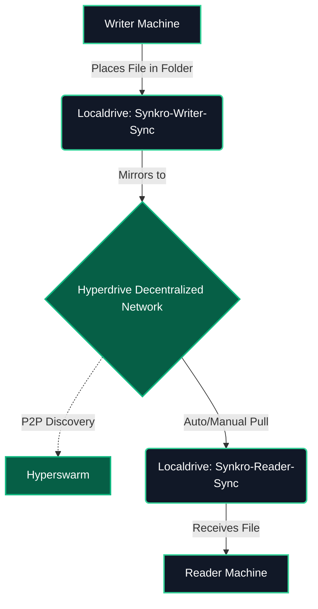
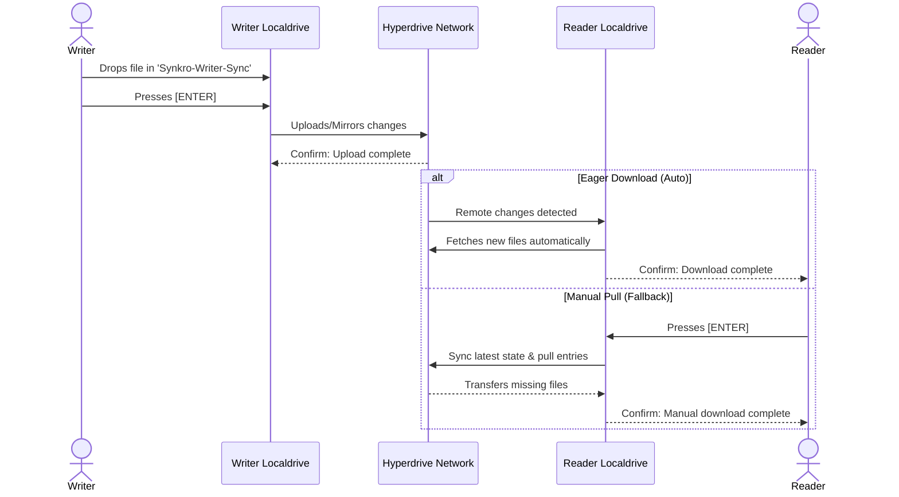

# 🔄 Synkro - Decentralized P2P File Synchronization


> **Serverless, lightning-fast file synchronization across devices using the Pear/Bare ecosystem.**

Synkro eliminates the need for centralized cloud storage (like Google Drive or Dropbox) by enabling direct, peer-to-peer (P2P) file synchronization. It securely mirrors files between a "Writer" (source) and one or multiple "Readers" (destinations) without any intermediary servers.

---

## 🔗 Quick Links
* 🚀 **Run the App (Pear Link):** `pear://z57bjw8s4n9mdf1oaj55yib13uhpzbncwctf6gm1q1j58cyc7u1o`
* 🎥 **Pitch/Demo Video:** [Insert Video URL Here]

---

## 🚀 The Problem vs. The Solution

* **The Problem:** Traditional file synchronization relies on centralized cloud providers, raising privacy concerns, requiring subscriptions, and creating single points of failure.
* **The Solution:** Synkro leverages **Hyperdrive** and **Localdrive** within the Pear ecosystem to create a serverless, end-to-end encrypted P2P synchronization tool. Files are transferred directly between peers in real-time.

---

## ⚙️ Core Features
* 🔗 **Peer-to-Peer Sync:** Direct file transfer without centralized servers.
* ⚡ **Eager Downloading:** Readers automatically detect and pull new files from the decentralized network.
* 🛡️ **Manual Fallback:** A robust "Enter to Pull" feature ensures files can always be synced manually if auto-sync faces network delays.
* 📁 **Auto-Directory Management:** Automatically generates required sync folders (`Synkro-Writer-Sync` & `Synkro-Reader-Sync`) for a seamless user experience.

---

## 📊 System Visualizations

### 1. System Architecture

### 2. Synchronization Flow (Writer to Reader)

## 🏗️ Architecture & Tech Stack
* **Ecosystem:** Pear / Bare (Serverless Runtime)
* **P2P Networking:** Hyperswarm
* **File System:** Hyperdrive (Decentralized) & Localdrive (Local FS interaction)
* **Core Logic:** JavaScript (ES Modules)

## 💻 How to Test & Use Synkro 
We have made it incredibly simple to test the P2P capabilities of Synkro without needing to download the source code.

### Prerequisites
Ensure you have the Pear runtime installed. If not, install it globally:
```bash
npm install -g pear
```
### Step 1: Start the Writer (Source)

* 1. Open a new terminal. 
* 2. Run the Synkro application via the Pear link:
```bash
pear run pear://z57bjw8s4n9mdf1oaj55yib13uhpzbncwctf6gm1q1j58cyc7u1o
```
* 3. The terminal will initialize the file system, generate a Drive Key, and auto-create a folder named Synkro-Writer-Sync in your current directory.
* 4. Copy the generated Drive Key.
#### Step 2: Start the Reader (Destination)

* 1. Open a second terminal (preferably in a different directory to see the magic clearly).
* 2. Run the same command, but paste the Drive Key at the end:
```bash
pear run pear://z57bjw8s4n9mdf1oaj55yib13uhpzbncwctf6gm1q1j58cyc7u1o <PASTE_DRIVE_KEY_HERE>
```
* 3. The terminal will connect to the Writer and auto-create a folder named Synkro-Reader-Sync.

### Step 3: Test the Sync!

* 1. Go to the Synkro-Writer-Sync folder and place any file (e.g., an image or text file) inside it.
* 2. Go back to the Writer Terminal and press ENTER to trigger the upload.
* 3. Check the Reader Terminal. It should automatically detect and download the file into the Synkro-Reader-Sync folder!
* 4. (Fallback Option): If the auto-download doesn't trigger immediately, simply press ENTER in the Reader Terminal to force a manual pull.

## 🛠️ Local Development
If you want to run the project locally from the source code:

* 1. Clone the repository and navigate to the project folder.
* 2. Run the Writer:
```bash
1. npm start
2. Press Enter
3. Copy drive-key
```
* 3. Run the Reader:
```bash
1. npm start
2. past the drive-key 
3. Press Enter
```
